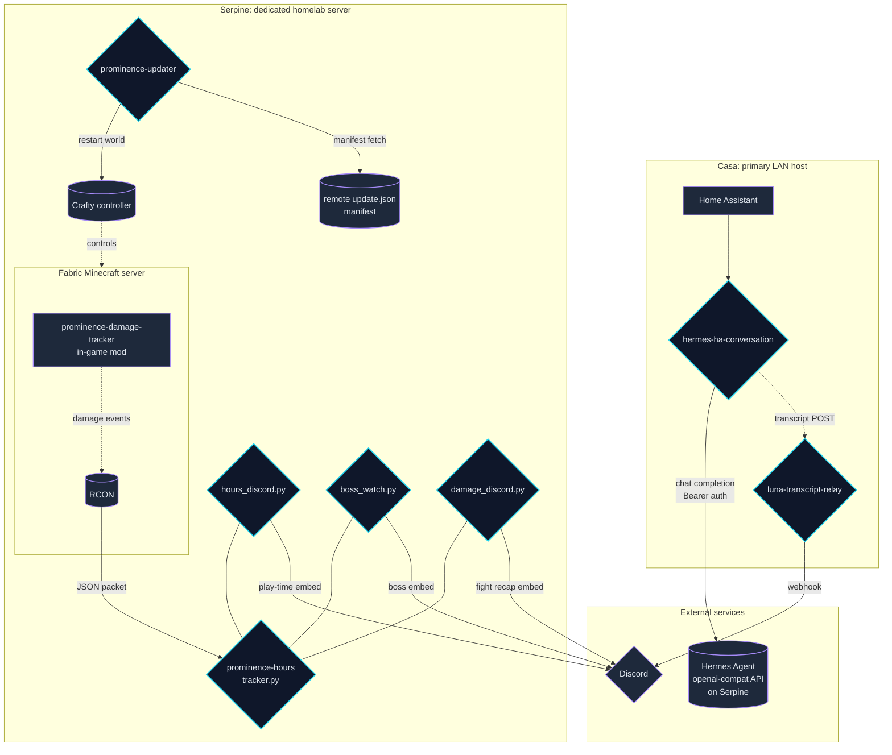
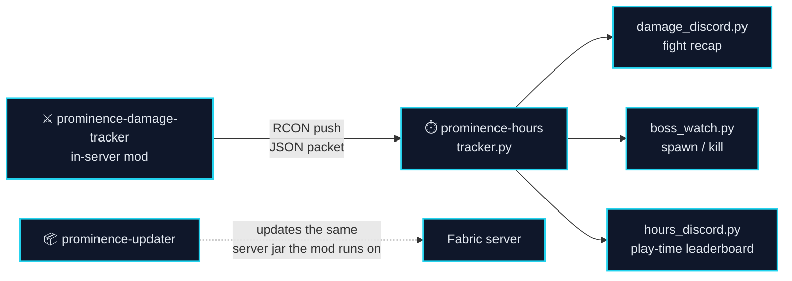
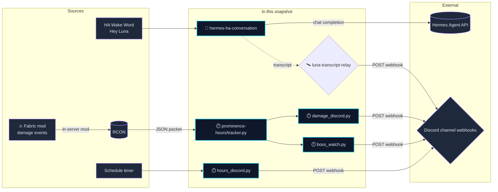
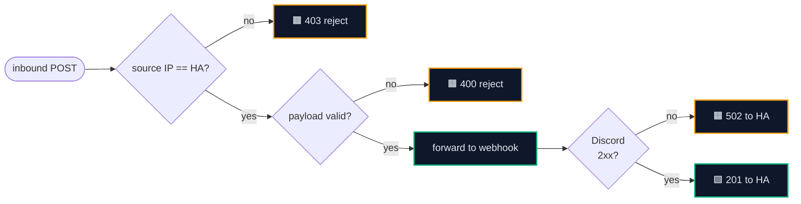
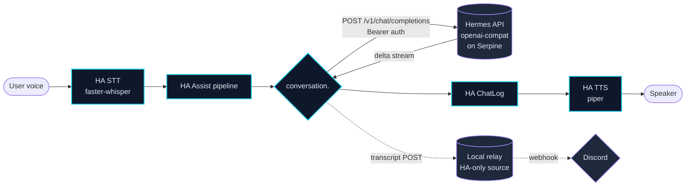
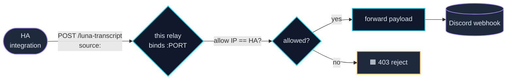
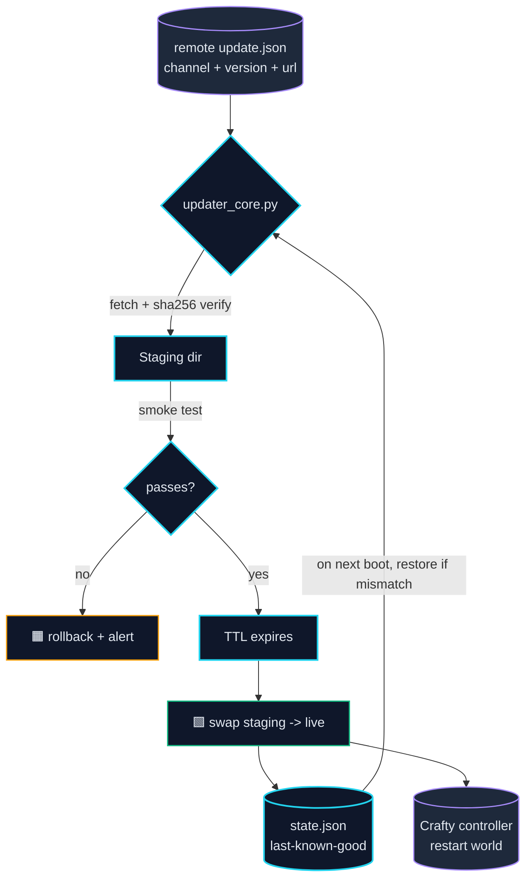
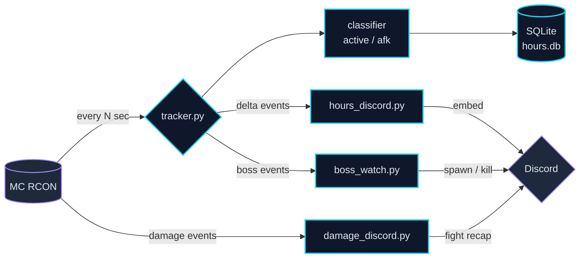
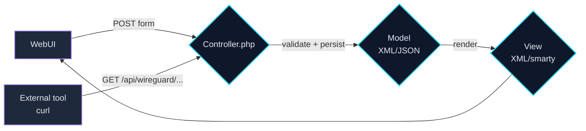

# NotMurky/projects

Public, sanitized mirror of internal automation projects. Synced weekly from the
running host so this page reflects what is currently deployed, not what was
deployed last time someone remembered to push.

> 🟦 Built from a working copy on **Casa**; Minecraft-side tooling runs on **Serpine**;
> the two clusters meet only at Discord.

> **Sanitized snapshot.** Internal IPs, host names of services, usernames, SSH keys,
> PEM material, and personal identifiers are redacted (`<…_REDACTED>` placeholders).
> The two home hosts are named (`Casa`, `Serpine`); everything else stays generic.

_Last refreshed: 2026-08-31._

---

```text
╔══════════════════════════════════════════════════════════════════════╗
║   Six self-contained automation projects.                            ║
║   Synced weekly from Casa and Serpine.                              ║
║   Sanitized. Self-explanatory. Single squashed commit.               ║
╚══════════════════════════════════════════════════════════════════════╝
```


---

## 🎨 Visual legend

| | |
|---|---|
| 🟦 **cyan** (`#22d3ee`) | This project's own surface — boxes drawn from this repo |
| 🟪 **violet** (`#a78bfa`) | External system / upstream / third-party service |
| 🟧 **amber** (`#f59e0b`) | Failure path / abort / rollback |
| 🟩 **emerald** (`#10b981`) | Success path / commit / promote |
| ⬛ **slate** (`#0f172a` / `#1e293b`) | Container / pipeline / host background |
| 🔘 dotted edge | Side / out-of-band signal (transcript, audit) |
| ──▶ solid edge | Primary data flow |
| 🟦 **Casa** | Primary LAN host (router/HA/panel) |
| 🟦 **Serpine** | Dedicated homelab server (Docker/MC/Hermes-side) |

## 📑 Table of contents

1. 🔗 [How the projects interact](#-how-the-projects-interact) — *The whole map.*
2. 🛰️ [Discord integration](#-discord-integration) — *Outbound-only webhook pattern, trust scoping.*
3. 🌙 [hermes-ha-conversation](#3-hermes-ha-conversation) — *HA voice → local Hermes Agent API.*
4. 🛰️ [luna-transcript-relay](#4-luna-transcript-relay) — *HA → Discord transcript relay.*
5. ⚔️ [prominence-damage-tracker](#5-prominence-damage-tracker) — *Minecraft Fabric damage mod.*
6. 📦 [prominence-updater](#6-prominence-updater) — *Controlled-rollout Minecraft updater.*
7. ⏱️ [prominence-hours](#7-prominence-hours) — *RCON/Discord play-time tooling.*
8. 🛡️ [wireguard-form-export](#8-wireguard-form-export) — *WireGuard form/view/controller exports.*

> **Sanitized snapshot.** Casa and Serpine as bare hostnames are public-safe; every
> IP, internal domain, username, SSH key, and PEM block is redacted.

---

## 🔗 How the projects interact

The six projects fall into three clusters that mostly don't talk to each other at runtime:

- 🌙🛰️ **Voice cluster** — `hermes-ha-conversation` + `luna-transcript-relay`. Bridges HA voice into a custom backend and posts transcripts to Discord. Runs on Casa.
- ⚔️📦⏱️ **Minecraft cluster** — `prominence-damage-tracker` + `prominence-updater` + `prominence-hours`. Runs on Serpine (mod runs in-server; trackers/updater run alongside).
- 🛡️ **Reference cluster** — `wireguard-form-export`. Pure documentation/export code; no runtime interaction with anything else.

### 🌍 Whole-system map



### 🧩 Cluster bridges

There is **no** runtime bridge between the Voice cluster (Casa) and the Minecraft cluster (Serpine) — they share only the Discord webhook endpoint as a sink. No shared state, no shared queue, no shared credentials.



### 📋 Edge-by-edge reference

| # | From | To | Wire | Payload | When |
|---|---|---|---|---|---|
| 1 | Home Assistant (Casa) | `hermes-ha-conversation` | Assist pipeline internal | transcribed text | per wake-word invocation |
| 2 | `hermes-ha-conversation` | Hermes Agent API (Serpine) | HTTPS, Bearer-auth | chat-completion POST + history | per voice turn |
| 3 | `hermes-ha-conversation` | `luna-transcript-relay` (Casa) | LAN HTTP POST | `{transcript, reply}` | after every voice turn |
| 4 | `luna-transcript-relay` | Discord webhook | HTTPS | JSON webhook body | per voice turn |
| 5 | `prominence-damage-tracker` mod (Serpine) | Minecraft server RCON | in-server | JSON line `{player, entity, hp, ts}` | per tracked-entity damage event |
| 6 | Minecraft server RCON (Serpine) | `prominence-hours/tracker.py` (Serpine) | TCP | JSON packet | pulled on tracker interval |
| 7 | `prominence-hours/damage_discord.py` | Discord webhook | HTTPS | fight-recap embed | on boss-fight end |
| 8 | `prominence-hours/boss_watch.py` | Discord webhook | HTTPS | boss spawn / kill embed | on event |
| 9 | `prominence-hours/hours_discord.py` | Discord webhook | HTTPS | play-time leaderboard | scheduled |
| 10 | `prominence-updater` (Serpine) | remote `update.json` | HTTPS GET | JSON manifest | every tick (N seconds) |
| 11 | `prominence-updater` | Crafty controller (Serpine) | HTTPS POST | restart command | after smoke-test + TTL passes |
| 12 | Crafty controller | Minecraft server | process control | stop / start world | per updater request |
| 13 | `prominence-updater` | staging dir | local FS | tarball + sha256 | during update |
| 14 | `prominence-updater` | `state.json` | local FS | JSON | per stage transition |
| 15 | `wireguard-form-export` | *(none)* | — | — | static reference code; not deployed |

### 🔒 Shared trust model

- **Casa (voice cluster)** trusts only the LAN IP list baked into `luna-transcript-relay`. Everything else (including `hermes-ha-conversation`) speaks to it from a known source.
- **Serpine (Minecraft cluster)** trusts the server's RCON password and the Discord webhook URL. Those are **not** shared with the voice cluster.
- **`wireguard-form-export`** is documentation only — it doesn't share credentials or have a runtime identity.

### 🔄 What the whole system looks like in motion

```text
voice → STT → HA Assist pipeline (Casa)
  → hermes-ha-conversation
      → chat completion against Hermes Agent (Serpine)
  ← reply streamed back
  → TTS → speaker
  → transcript POST → luna-transcript-relay → Discord

(separately, on Serpine)
Minecraft server damage events
  → RCON → prominence-hours/tracker.py
  → prominence-hours/damage_discord.py → Discord
```

The two paths meet only at Discord.

---

## 🛰️ Discord integration

Discord is the single visible human surface across the snapshot. Four different agents in this repo post into Discord; each one has a narrow, scoped role and a tightly bounded credential.

### 📌 What "Discord integration" covers

In this snapshot, **Discord integration** is the **outbound webhook path only** — four services post embed-style messages into Discord via webhook URLs. We do **not** ship any *bidirectional* Discord bot (no `discord.py` runtime with token, no slash commands, no message-reading). Bidirectional Discord lives in the upstream Hermes Agent gateway codebase, which is not in this repo.

| Agent | Host | Webhook URL per channel? | Auth | Rate-limit posture |
|---|---|---|---|---|
| `luna-transcript-relay` | Casa | one global webhook URL | env `DISCORD_WEBHOOK_URL` (relay only) | per-message, low volume |
| `prominence-hours/damage_discord.py` | Serpine | one channel webhook | env `DISCORD_WEBHOOK_URL` (host only) | bursts at boss-fight end |
| `prominence-hours/boss_watch.py` | Serpine | one channel webhook | env `DISCORD_WEBHOOK_URL` (host only) | sporadic, event-driven |
| `prominence-hours/hours_discord.py` | Serpine | one channel webhook | env `DISCORD_WEBHOOK_URL` (host only) | scheduled (daily/weekly) |

> Each agent holds its webhook URL **itself** — there is no shared "Discord credentials" store in the snapshot.

### 🔌 Why the relay exists

`luna-transcript-relay` could in principle be replaced by a Discord webhook directly callable from HA — but that would mean putting the webhook URL in the HA `secrets.yaml`/`configuration.yaml`, where *every* blueprint and integration could read it. The relay narrows the trust boundary:

- The webhook URL lives only on the relay host (Casa).
- The relay binds a LAN IP and accepts connections only from HA's source IP (else 403).
- The relay has no admin/auth endpoints; one path, one purpose, fail-closed.

The other three agents bypass the relay because they already live on Serpine and have the only webhook URL they need.

### 🗺️ End-to-end Discord map



### 🔒 Trust model

| Boundary | Host | Direction | Auth |
|---|---|---|---|
| `hermes-ha-conversation` → Hermes Agent API | Casa → Serpine | outbound | HTTPS Bearer token in message headers |
| `luna-transcript-relay` ← HA integration | Casa | inbound | LAN source-IP allow-list (single host) |
| `luna-transcript-relay` → Discord webhook | Casa | outbound | one webhook URL held in relay env only |
| `prominence-damage-tracker` mod → RCON | Serpine | in-server | Minecraft RCON password |
| `prominence-hours/tracker.py` ← RCON | Serpine | inbound | TCP to RCON port + password in env |
| `prominence-hours/*_discord.py` → Discord webhook | Serpine | outbound | one webhook URL each in same-host env |

### 🧾 What gets posted into Discord — examples

```text
[luna-transcript]              "transcript" + "reply"      — from hermes-ha-conversation
[fight-recap]                  "Boss: <name>"
                               "Top DPS: <player> <value>"
[boss-watch]                   "Spawned: <boss> in <biome>"
                               "Slain: <boss> by <player>"
[hours-leaderboard]            "<nick> — <hours>h"
```

### 🛡️ What the relay actually rejects



### 🚧 What's *not* in scope here

- **Bidirectional Discord bot** — upstream Hermes gateway codebase, not in this snapshot.
- **Reading from Discord** — none of the snapshot agents consume Discord events.
- **Multi-channel fanout** — each agent has exactly one destination channel.
- **Persistence of posted content** — Discord itself is the durable record.

### ➕ Extending the Discord surface

1. **Same-host poster (preferred).** Direct webhook URL in the agent's own env.
2. **Cross-host poster.** Relay pattern with source-IP allow-list.

**Never share a webhook URL across hosts.**

---

## 3. 🌙 hermes-ha-conversation

> 🟦 A Home Assistant custom component that adds a new conversation agent backed by a local OpenAI-compatible Hermes Agent endpoint.

### Why it exists

HA's default conversation agent can speak Lovelace intent directly, but it can't talk to a private, custom LLM backend. This integration adds a `conversation.<name>` entity whose job is exactly that: take a transcribed turn, send it to a Hermes-style HTTP API with proper auth, stream the reply back token-by-token into the HA chat log, and post a transcript to a side relay so we can review the assistant's calls in Discord.

The relationship is a *bridge*, not a rewrite — HA still owns wake-word routing, VAD, intent handling, and TTS. The integration only owns the "send → stream → return" cycle.

### 🗺️ Architecture



### ⚙️ How it works (cause and effect)

1. **Wake → STT.** Panel says the wake word; HA selects the conversation pipeline (`stt.faster-whisper` → this `conversation.<name>` → `tts.piper`).
2. **Bridge call.** HA hands the transcribed utterance to this integration. It opens an HTTP POST to the configured Hermes base URL with the conversation history baked into the messages payload.
3. **Streaming.** Hermes returns OpenAI-style `data: {…}` chunks. Each chunk is appended to a generator of `{"content": …}` deltas; HA's `chat_log.async_add_delta_content_stream` consumes them, so the chat log fills progressively.
4. **TTS.** When the deltas stop, HA hands the whole transcript to Piper, plays it back.
5. **Side transcript.** In parallel, the integration posts the final (user, assistant) pair to a LAN-only relay which forwards to Discord. The relay hard-rejects any source IP that isn't HA's.

### 📝 Config-flow fields

| Field | Purpose |
| --- | --- |
| `base_url` | Hermes-style OpenAI-compatible endpoint |
| `api_key` | Bearer token. Stored only in HA's config-entry storage. |
| `timeout_seconds` | Per-turn timeout |

### 🛠️ Install

```bash
cp -r projects/hermes-ha-conversation/custom_components/hermes_conversation \
      /config/custom_components/
# Restart Home Assistant
# Settings -> Devices & Services -> Add Integration -> Hermes Agent Conversation
# Fill base_url, api_key, timeout_seconds -> Submit
```

### 🧪 Tests

```bash
cd projects/hermes-ha-conversation
python3 -m unittest tests.test_client -v
```

### ⚠️ Failure modes

- 🟧 **Hermes is down.** Returns `assistant unavailable`; the panel keeps working with the other wake word.
- 🟧 **Slow first token.** Chat log streams, but TTS buffers. Latency ≈ prefill + first-token + Piper synthesis.
- 🟧 **Wrong base URL.** Typed error; HA retries; nothing crashes.

---

## 4. 🛰️ luna-transcript-relay

> 🟦 A single-purpose HTTP webhook relay whose job is to forward the assistant's voice transcripts to a Discord webhook. Hard-locked to a single allow-listed source IP.

### Why it exists

We want a paper trail of what the assistant is asked and how it answers — but we don't want to expose a Discord webhook URL to anything that isn't HA. The relay enforces that boundary by hard-coding the source-IP allow-list at startup and serving no other endpoint.

### 🗺️ Architecture



### ⚙️ How it works

1. Integration POSTs `{transcript, reply}` to `/luna-transcript`.
2. The relay inspects the request's source IP. Anything not on the allow-list is rejected with `403` immediately. 🟧
3. If allowed 🟩, the relay forwards the payload as a Discord-compatible webhook.
4. Discord returns 2xx → relay returns 201 to HA. Any other status → relay returns 502 (HA doesn't retry; the chat already happened).

### 🛠️ Run

```bash
cd projects/luna-transcript-relay
python3 luna_transcript_relay.py
```

Set `DISCORD_WEBHOOK_URL` in env. Bind and allow-list are read from constants; configure for your own network before deploying.

### 🧪 Tests

```bash
cd projects/luna-transcript-relay
python3 -m unittest tests.test_relay -v
```

### ⚠️ Failure modes

- 🟧 **Webhook URL revoked.** Returns 502 to HA; conversation still completes; transcript is the loss.
- 🟧 **Wrong source IP.** 403 immediately, before any work — by design.

---

## 5. ⚔️ prominence-damage-tracker

> 🟦 A Minecraft Fabric server-side mod that records every damage event against a list of tracked bosses, ships the events over RCON to a companion Python tracker, and lets the tracker post per-fight summaries to Discord.

### Why it exists

Plain server logs only give you deaths, not damage composition. We needed a per-player, per-fight, per-entity damage tally without forcing players to run a client mod. Running server-side + RCON is the path that works on a hosted Forge/Fabric server without client install requirements.

### 🗺️ Architecture

```mermaid
flowchart TB
  subgraph MC[Minecraft server fabric]
    MOD[Damage mod listener<br/>server-side]
    BOSS[Tracked entities<br/>registry]
    RCON[(RCON server<br/>TCP)]
  end
  MOD -- "on damage vs tracked entity" --> LOG[JSON line<br/>{player, entity, hp, ts}]
  LOG -- "RCON 'tellraw' style push" --> RCON
  BOSS -. "ids + aliases" .-> MOD
  RCON -- "JSON packet" --> TRACK{tracker.py<br/>Python}
  TRACK -- "per-player totals" --> STORE[(SQLite)]
  TRACK -- "embed per fight" --> DC{Discord}
  classDef ext fill:#1e293b,stroke:#a78bfa,color:#e2e8f0,stroke-width:1.5px;
  classDef own fill:#0f172a,stroke:#22d3ee,color:#e2e8f0,stroke-width:2px;
  class MC,MOD,BOSS,RCON,LOG,STORE,DC ext;
  class TRACK own;
```

### ⚙️ How it works

1. On every server tick, the listener queries any tracked entity's recent damage history and rolls it up.
2. Per aggregation, the mod writes a JSON line containing the player UUID, entity id, hit value, and timestamp.
3. Those lines are queued and pushed over RCON to a known command that the *tracker* Python process is listening for.
4. The tracker ingests, normalizes, and rolls up per-player totals. When a fight ends (configurable threshold), it posts a Discord embed.

### 🛠️ Build

```bash
cd projects/prominence-damage-tracker
./gradlew build
```

Build outputs land in `build/`. Source tree only ships here; `.gradle/`, `build/`, and IDE caches are excluded.

### ▶️ Run

- The compiled `.jar` lands in `build/libs/` and goes into the Fabric server's `mods/` directory.
- The companion `tracker.py` lives in `projects/prominence-hours/` and runs as a systemd service on Serpine.

### ⚠️ Failure modes

- 🟧 **RCON queue overflow.** The listener back-pressures; older events are dropped with a warning rather than blocking the server.
- 🟩 **Tracker offline.** Events queue in the mod for a bounded window; on reconnect the tracker pulls missed events.
- 🟧 **Mod version mismatch.** Tracked entities are version-keyed; an unrecognized id is reported as unknown and ignored, no crash.

---

## 6. 📦 prominence-updater

> 🟦 Standalone Python updater that keeps a Minecraft server build in sync with a remote version manifest, with controlled rollouts (canary → stable → channels).

### Why it exists

Two needs collide:

1. **Auto-update.** When we ship a new modpack we want it live without manual work.
2. **Don't break the live world.** A bad build should never auto-replace a good one.

The updater solves (1) without giving up (2) by separating *staging* from *promotion*. New builds land in a staging directory; the live directory only flips after a configurable smoke-test + TTL window passes. Last-known-good state is persisted in `state.json` so an interrupted update is rolled back on next boot.

### 🗺️ Architecture



### ⚙️ How it works (cause and effect)

1. Loop ticks every N seconds. Calls `GET <remote>/update.json`.
2. If `version > running_version` *and* channel matches policy (canary → stable), the updater fetches the artifact, sha256-verifies, and drops it into staging.
3. Staging is boot-tested independently (server start → expect a known log line → stop).
4. If the smoke test passes 🟩, a TTL timer starts. After it expires with no failures, staging becomes live 🟩.
5. Crafty is asked to restart the world. Restart completes. `state.json` records the new "last-known-good".
6. If anything between (2) and (5) fails 🟧, `state.json` is consulted on next boot and we roll back to `last-known-good`.

### 🛠️ Run

```bash
cd projects/prominence-updater
python3 app.py
```

Required env (set on the systemd unit, see `prominence-updater.service`):

| Var | Purpose |
| --- | --- |
| `CRAFTY_BASE` | Crafty controller URL |
| `ARTIFACT_BASE_URL` | Where staged builds live |
| `UPDATE_JSON_URL` | Where the manifest lives |

### 📝 Contract

See `UPDATE-CONTRACT.md` for the schema of the remote manifest.

### 🧪 Tests

```bash
cd projects/prominence-updater
python3 -m unittest tests -v
```

### ⚠️ Failure modes

- 🟧 **Manifest unreachable.** Skip the tick; keep running on current live.
- 🟧 **Smoke test fails.** Stay on current live; do not promote.
- 🟧 **Promotion aborts mid-restart.** On next boot, `state.json` mismatch triggers rollback.

---

## 7. ⏱️ prominence-hours

> 🟦 Python tooling that ingests Minecraft mod events via RCON, computes play-time and AFK state per player, and posts summaries to Discord.

### Why it exists

A host server gives you raw chat / join / leave but no player-composition lens: who's actually online vs. who's afk in a corner. We wanted a daily player-hours report and a per-session boss-fight log. Both are derived from the same RCON stream.

### 🗺️ Architecture



### ⚙️ How it works

1. **Tracker loop.** Every N seconds, query RCON for the player list and each player's position. Run a per-player AFK classifier based on a configured inactivity threshold.
2. **Persist.** Active/AFK durations go to `hours.db` (cumulative per day, per week, per month).
3. **Discord post (hours).** At configurable times, post a play-time leaderboard to a Discord channel.
4. **Boss watch.** A separate watcher subscribes to a "boss spawn / boss kill" event stream (sourced from the same RCON but routed through `prominence-damage-tracker`). It posts role-call and victor announcements.
5. **Damage recap.** On boss-fight end, post the per-player damage summary (sourced from `prominence-damage-tracker`).

### 🛠️ Run

```bash
cd projects/prominence-hours
python3 tracker.py
```

Required env:

| Var | Purpose |
| --- | --- |
| `RCON_HOST` / `RCON_PORT` | Minecraft server RCON |
| `RCON_PASSWORD` | Provided via env, never in this snapshot |
| `DISCORD_WEBHOOK_URL` | Posting target |

`*.service` and `*.timer` units tie the various loops together.

### 🧪 Tests

```bash
cd projects/prominence-hours
python3 -m unittest discover tests -v
```

### ⚠️ Failure modes

- 🟧 **RCON unreachable.** Tracker sleeps with backoff; no events lost.
- 🟧 **Webhook rate-limited.** Posts batch; backoff respects 429.
- 🟧 **Hours DB full.** Auto-vacuum keeps most-recent 90 days.

---

## 8. 🛡️ wireguard-form-export

> 🟦 WireGuard form / view / controller code, exported for documentation and reference. The PHP scripts show how to read and write WireGuard peer state through a firewall management console's model API.

### Why it exists

A firewall management console exposes WireGuard state through a layered form/view/controller model. If you want to read or write peer state from an external tool, you have to know which API call maps to which UI element. This folder collects the relevant forms, views, and controllers in one place so they're easy to read and easy to diff.

### 🗺️ Architecture



### ⚙️ How it works

1. UI submits an HTML form. The matching controller method takes the request, validates it, and persists to the model (XML on disk + in-memory cached JSON).
2. Reads come either through the model directly or via the `XMLRPC` / REST endpoint that the controller exposes.
3. Views render the latest state back into the UI.
4. External callers (like our automation) speak REST/JSON to the same controller and get a stable API surface.

### 🧭 How to read it

```text
projects/wireguard-form-export/
├── GeneralController.php       ← HTTP API for global settings
├── General.xml                 ← form / fields definition
├── ServerController.php        ← per-interface (server) API
├── Server.xml
├── ClientController.php        ← per-peer API
├── Client.xml
└── ServiceController.php       ← service start / stop / restart
```

### ⚠️ Sanitization note

Internal interface names, public keys, and personal identifiers have been replaced with `<…_REDACTED>` placeholders. The PHP code is illustrative — do not deploy unmodified against a real firewall.

---

## 🔒 What was not shipped

- 🟧 **Credentials of any kind.** Live `.env*` files, secrets, OAuth tokens, or any credential that ever left the running host.
- 🟧 **Keys.** SSH keys (public or private), PEM blocks, internal VPN public keys, MAC / serial numbers.
- 🟧 **Topology beyond hostnames.** Internal IPs, internal domain names, vendor-host nicknames. (`Casa` and `Serpine` as bare words stay.)
- 🟧 **Identities.** Personal usernames, contact info.
- 🟧 **Upstream content.** Cloned upstream repositories (`voicebox`, `jarvis`, `obico-server`, etc.) — those live with their original authors.
- 🟧 **Build noise.** Build artifacts, model checkpoints, vendored dependencies, generated docs.

## 🔁 Refresh policy

This snapshot refreshes weekly from the working copy (Monday, EDT). The redaction script and the source-tree scan live in cron-managed automation. If you find anything resembling a credential in this repo, it is a bug — file an issue or contact the maintainer offline.

## 📄 License

See the per-project `LICENSE` files where present. Some contents originate from upstream projects and may carry their original LICENSE files.
